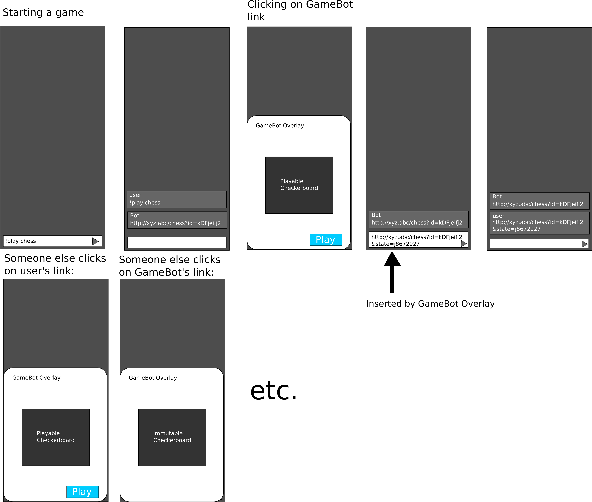

# GaimBot

GaimBot (aka GameBot because the code says so) is a platform that lets you play games on your phone, like how GamePigeon works, and works on any chat platform. 

## Why

Android users can't play GamePigeon games so we decided to make this. Oh, and it'll also work on iOS, so that's a yay for **everyone** (Unless you use Ubuntu Touch, but GaimBot will also support that as well, albeit less well).

## How it works

GaimBot has two components: the **app** and the **bot**. This is the **bot**.
The GaimBot has a bunch of games built-in (currently we just implemented tic-tac-toe). GaimBot is based on HTML5/JS which makes it super cross-platform.

Essentially we have an API that works like this that our app will use.

* `/<game>/create` -> creates a game. Returns a unique ID `gameId`.
* `/<game>/stateUI` -> gets a playable game (eg. a chess board). This takes `gameId` as a request parameter. It also takes a `stateId` as a request parameter to show a specific game state. It redirects to `/<game>/getStateUIUrl` for the app to get the "next move url." This will be able to detect if the stateId is the newest move and make the board editable based on this or not.
* `/<game>/getStateUIUrl` -> gets a stateUI as a URL, based on a `gameId` and a `stateId`. This is for the app to parse the JSON data of `stateUIUrl` and send this in a chat's textbox (using AutoFill or something, we haven't figured this out entirely yet).
* `/<game>/setState` -> sets a new state for the game based on `state` which is JSON data of the state of the board. Also takes a `gameId`. Returns a `stateId` which is the the unique id of that new state.

Basically the app operates with all of these and can do everything. Below is a UI mockup of what we expect GaimBot to look like.

